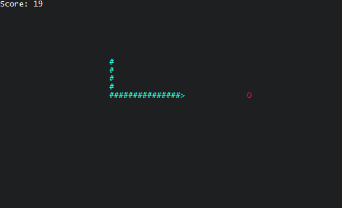

# snake

A terminal-based game of snake written in pure C11 using ncurses.

## Instructions

### Building & Running

**Requirements:** POSIX-compliant operating system with libncurses installed.

Run the following command to compile the game:
```
$ make all
```
Then you can simply run the resulting executable:
```
$ ./snake
```

## Controls

To steer the snake you can use WASD or simply the arrow keys. Move the Snake (represented by `#`)
to collect apples (`O`).

## Screenshot

.

## Bugs

 - Snake can simply run of the screen
 - Snake can collide with itself with no repurcussions

## License

Licensed under the [MIT License](LICENSE.md).
